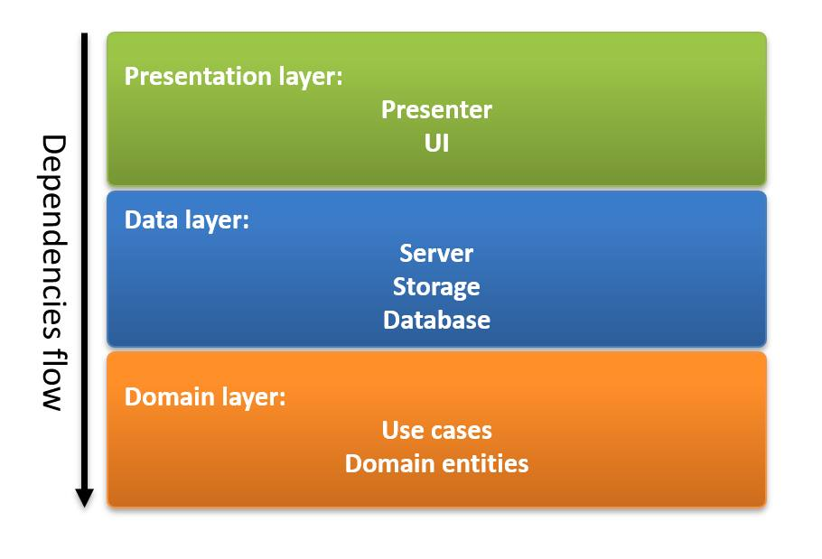
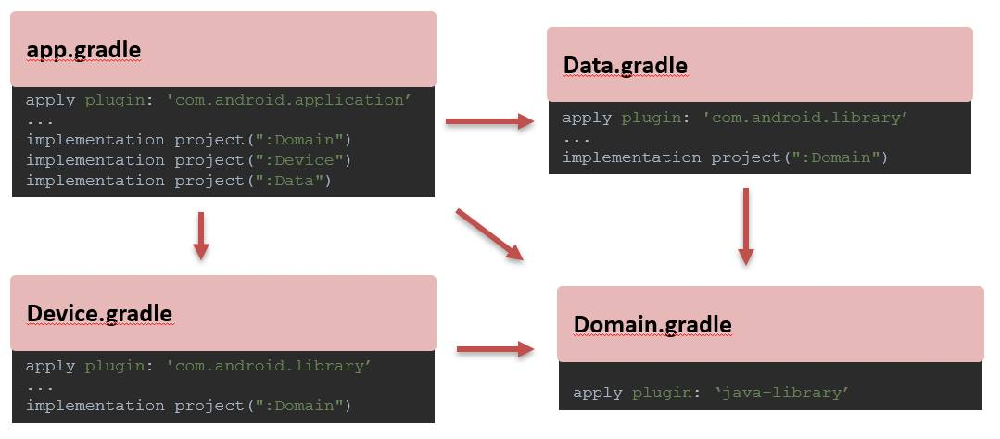

# Android Clean architecture - Kotlin
Khung chương trình dựa trên quan điểm thiết kế clean architecture & MVVM
# New Features!
-  Thêm chức năng scan barcode tại module Device

You can also:
- Biết cách xây dựng một chương trình theo kiến trúc Clean Architecture
- Dựng Source Base MVVM-CleanArchitecture với Coroutine

## 1. Domain
**KEY POINT** của Clean Architecture là Domain layer - **Abstraction layer** - chứa toàn bộ business logic của ứng dụng. Đây là một module abstract - độc lập hoàn toàn, hay nói cách khác là không có bất cứ dependency nào với Android Framework. Chính vì vậy project type của nó là java hoặc kotlin project (**pure Java/Kotlin**). Tức là file .gradle sẽ quy định như sau:

``
apply plugin: 'java-library'  
apply plugin: 'kotlin'
``

Nếu bạn nhìn thấy file .gradle của module Domain quy định:

``
apply plugin: 'com.android.library'  
apply plugin: 'kotlin-android'  
apply plugin: 'kotlin-android-extensions'
``

Thì là quy định **SAI**, Domain phụ thuộc vào framework thì không còn là abstraction layer nữa.
Domain sẽ bao gồm Entities, use cases, repositories interfaces, device interfaces...(Những thứ thuộc về abstraction)
Ví dụ, Chuyển tiền từ tài khoản A sang tài khoản B, các step liên quan, các actor liên quan(ở dạng abstraction)
## 2. Data
Data module(về mặt vật lý) chịu trách nhiệm xử lý toàn bộ các vấn đề liên quan đến dữ liệu. Ví dụ: Lưu dữ liệu vào đâu, gọi restful api thế nào, dùng DB là room hay sqlite, config lưu trong SharePreference hay DataStore, dữ liệu được mã hoá khi lưu xuống hay để là plaintext ..etc
Project type của Data sẽ là Android Project
## 3. Device
Toàn bộ phần xử lý liên quan đến Device - những thứ mà ***'thuộc về'*** Device sẽ đặt trong Module Device.
Ví dụ: ConnectionManager, NotificationManager, Camera, hoặc các peripherals như Máy in -Printer, Máy scan hoặc Sensors..etc
Project type của Device sẽ là Android Project
## 4. App module (UI module)
Module application thông thường, là nơi khởi tạo kết nối giữa Data, Device, Domain
Các class liên quan đến ứng dụng như ViewModel, Presenter, Adapter, Activity, Views...etc sẽ đặt trong App Module
## Dependencies Rule
Clean architecture tuân thủ tuyệt đối DI - Dependency Inversion

## Dependencies Of modules

### Plugins
#If you want to test project - please create API key from https://developers.themoviedb.org/3/movies
and add your key in gradle.propeties file

``
moviedb_access_key="PLACE YOUR KEY IN HERE" 
``
### Plugins
N/A

| Plugin | README | LICENSE
| ------ | ------ |-------

### TO DO

- N/A

License
----

MIT 2.0
Copyright <2021> <baka3k@gmail.com>

Permission is hereby granted, free of charge, to any person obtaining a copy of this software and associated documentation files (the "Software"), to deal in the Software without restriction, including without limitation the rights to use, copy, modify, merge, publish, distribute, sublicense, and/or sell copies of the Software, and to permit persons to whom the Software is furnished to do so, subject to the following conditions:

The above copyright notice and this permission notice shall be included in all copies or substantial portions of the Software.

THE SOFTWARE IS PROVIDED "AS IS", WITHOUT WARRANTY OF ANY KIND, EXPRESS OR IMPLIED, INCLUDING BUT NOT LIMITED TO THE WARRANTIES OF MERCHANTABILITY, FITNESS FOR A PARTICULAR PURPOSE AND NONINFRINGEMENT. IN NO EVENT SHALL THE AUTHORS OR COPYRIGHT HOLDERS BE LIABLE FOR ANY CLAIM, DAMAGES OR OTHER LIABILITY, WHETHER IN AN ACTION OF CONTRACT, TORT OR OTHERWISE, ARISING FROM, OUT OF OR IN CONNECTION WITH THE SOFTWARE OR THE USE OR OTHER DEALINGS IN THE SOFTWARE.

